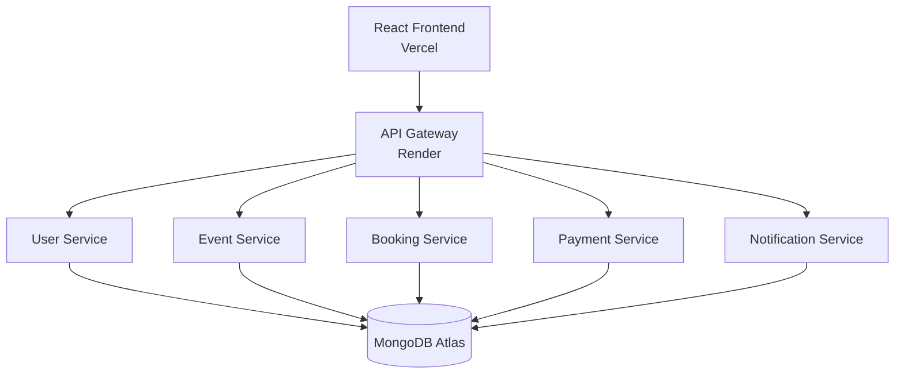
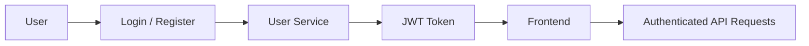
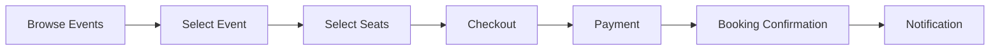

# 🎫 TicketX – AI-Powered Ticket Booking System

TicketX is a full-stack ticket booking application that allows users to discover events, select seats, book tickets, manage bookings, and receive notifications. The backend follows a **microservices architecture** for better modularity and scalability.

## 🌐 Live Application

**Frontend:** https://ticketx-ticket-booking-system.vercel.app/

**API Gateway:** https://ticketx-api-gateway.onrender.com

---

## 🚀 Features

- User registration and JWT-based login
- Browse and view events
- Interactive seat selection
- Ticket booking and payment workflow
- Booking history
- Email notifications
- Protected routes
- REST API communication
- Cloud deployment

---

## 🛠️ Tech Stack

| Category | Technologies |
|---|---|
| Frontend | React.js, Vite, JavaScript, Axios, CSS |
| Backend | Node.js, Express.js, REST APIs, JWT |
| Database | MongoDB Atlas |
| Deployment | Vercel, Render |
| Version Control | Git, GitHub |

---

## 🏗️ System Architecture

TicketX uses a **microservices architecture** where the frontend communicates with the backend through a centralized API Gateway.



### Architecture Overview

- **React Frontend** – Provides the user interface.
- **API Gateway** – Acts as the single entry point for frontend API requests.
- **User Service** – Handles authentication and user management.
- **Event Service** – Manages events and event details.
- **Booking Service** – Handles seats and ticket bookings.
- **Payment Service** – Manages payment-related operations.
- **Notification Service** – Handles booking-related email notifications.
- **MongoDB Atlas** – Provides cloud database storage.

---

## 📂 Project Structure

```text
TicketX/
│
├── backend/
│   ├── api-gateway/
│   ├── user-service/
│   ├── event-service/
│   ├── booking-service/
│   ├── payment-service/
│   └── notification-service/
│
├── frontend/
│
├── infra/
│
├── docs/
│
├── LOGO.png
├── .gitignore
└── README.md
```

---

## 🔧 Microservices

### 👤 User Service
Handles:
- User registration
- Login
- JWT authentication
- User management

### 🎫 Event Service
Handles:
- Event listing
- Event details
- Event availability

### 🎟️ Booking Service
Handles:
- Seat selection
- Ticket booking
- Booking history
- Booking expiration

### 💳 Payment Service
Handles:
- Payment workflow
- Payment records
- Payment-related operations

### 📧 Notification Service
Handles:
- Booking notifications
- Email communication
- Notification records

### 🚪 API Gateway
Provides a single entry point between the frontend and backend microservices and routes requests to the appropriate service.

---

## 🔐 Authentication

TicketX uses **JWT-based authentication**.



JWT tokens are automatically attached to API requests using Axios interceptors.

---

## 🗄️ Database

MongoDB Atlas is used as the cloud database platform.

The application uses separate databases for different services:

```text
user_db
event_db
booking_db
ticketx_payments
ticketx_notifications
```

This separation keeps service data logically independent.

---

## 🎟️ Booking Flow

The ticket booking process follows this flow:



---

## 💻 Local Setup

### Prerequisites

- Node.js
- npm
- Git
- MongoDB or MongoDB Atlas

Check the installations:

```bash
node --version
npm --version
git --version
```

### Clone the Repository

```bash
git clone https://github.com/YOUR_USERNAME/TicketX-AI-Ticket-Booking-System.git
cd TicketX-AI-Ticket-Booking-System
```

### Run Frontend

```bash
cd frontend
npm install
npm run dev
```

The frontend normally runs at:

```text
http://localhost:5173
```

### Run Backend

Each backend service has its own dependencies.

Example:

```bash
cd backend/user-service
npm install
npm start
```

The same process can be followed for the other backend services.

---

## ⚙️ Environment Variables

Create appropriate `.env` files for local development.

Example backend configuration:

```env
PORT=5001
MONGO_URI=your_mongodb_connection_string
JWT_SECRET=your_secret
```

Frontend configuration:

```env
VITE_API_BASE_URL=http://localhost:5000/api
```

**Never commit passwords, database credentials, JWT secrets, SMTP credentials, or API keys to GitHub.**

---

## ☁️ Deployment

| Component | Platform |
|---|---|
| Frontend | Vercel |
| Backend Services | Render |
| API Gateway | Render |
| Database | MongoDB Atlas |
| Source Code | GitHub |

### Production API

```text
https://ticketx-api-gateway.onrender.com/api
```

---

## 🔮 Future Enhancements

- AI-based event recommendations
- Personalized event suggestions
- Real payment gateway integration
- QR-code ticket verification
- Admin dashboard
- Real-time seat availability
- Redis caching
- Advanced analytics

---

## 🎯 Objective

The objective of TicketX is to demonstrate a real-world full-stack application using **React, Node.js, Express, MongoDB, JWT authentication, microservices, API Gateway, and cloud deployment**.

---

## 🌐 Live Project

**TicketX:**  
https://ticketx-ticket-booking-system.vercel.app/

⭐ Built as a full-stack cloud-deployed ticket booking platform.
